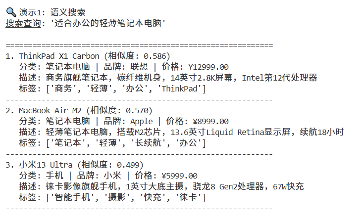
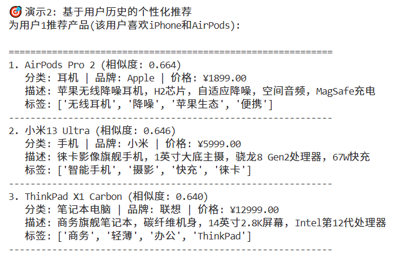
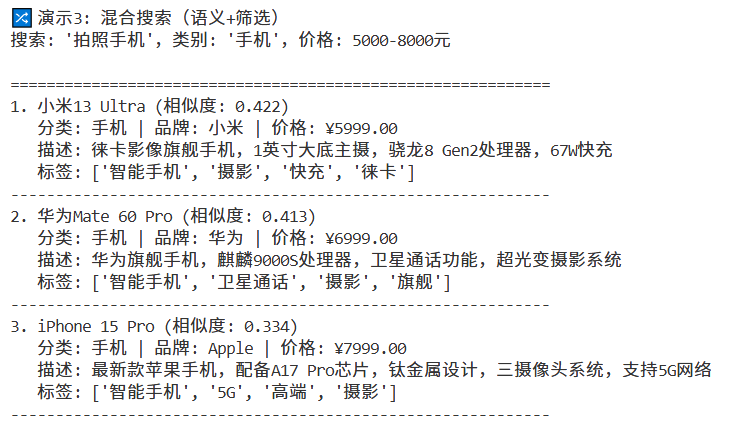
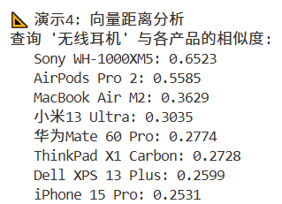

🛍️ OpenTenbase + pgvector 产品推荐系统 Demo

> 基于向量相似度的产品推荐系统，使用 OpenTenBase + pgvector 扩展

本 Demo 展示了如何构建一个现代化、语义感知的产品推荐引擎，支持：

- ✨ 本地文本嵌入向量生成
- ✨ OpenTenBase 向量数据库存储
- ✨ 高效 HNSW 向量索引加速查询
- ✨ 语义相似度搜索
- ✨ 基于用户行为的个性化推荐
- ✨ 混合搜索（语义 + 传统属性筛选）

---

## 📦 系统架构概览

本系统基于以下技术栈构建：

- **数据库**: OpenTenBase (兼容 PostgreSQL)
- **向量扩展**: `pgvector` — 支持高维向量存储与相似度计算
- **嵌入模型**: `SentenceTransformer` — 使用 `all-MiniLM-L6-v2` 本地模型生成 384 维语义向量
---

## 🧩 核心功能模块

### 1. 数据库初始化与结构

系统自动创建以下表结构：

#### `products` 表
| 字段名 | 类型 | 说明 |
|--------|------|------|
| id | SERIAL PRIMARY KEY | 产品唯一ID |
| name | VARCHAR(255) | 产品名称 |
| description | TEXT | 产品描述（用于语义向量化） |
| category | VARCHAR(100) | 产品分类 |
| price | DECIMAL(10,2) | 价格 |
| brand | VARCHAR(100) | 品牌 |
| tags | TEXT[] | 标签数组 |
| created_at | TIMESTAMP | 创建时间 |
| description_embedding | VECTOR(384) | 描述文本的语义向量 |

#### `user_behaviors` 表
| 字段名 | 类型 | 说明 |
|--------|------|------|
| id | SERIAL PRIMARY KEY | 行为ID |
| user_id | INTEGER | 用户ID |
| product_id | INTEGER (FK) | 产品ID |
| action_type | VARCHAR(50) | 行为类型（view/like/purchase/add_to_cart） |
| rating | INTEGER (1~5) | 评分（可选） |
| created_at | TIMESTAMP | 行为时间 |

---

### 2. 向量索引

系统为 `description_embedding` 字段创建 **HNSW 索引**，支持高效的余弦相似度搜索：

```sql
CREATE INDEX IF NOT EXISTS products_description_embedding_idx 
ON products USING hnsw (description_embedding vector_cosine_ops)
WITH (m = 16, ef_construction = 64);
```

---

### 3. 语义搜索功能

```python
def semantic_search(self, query: str, limit: int = 5) -> List[Tuple]
```

**输入**：自然语言查询（如“适合办公的轻薄电脑”）  
**输出**：按语义相似度排序的产品列表（含相似度分数）

**原理**：
- 使用 `SentenceTransformer` 将查询文本编码为 384 维向量
- 使用 PostgreSQL 的 `<=>` 操作符计算余弦距离
- SQL 中 `1 - cosine_distance` 得到相似度分数（0~1）

---

### 4. 个性化推荐

```python
def recommend_by_user_history(self, user_id: int, limit: int = 5) -> List[Tuple]
```

**流程**：
1. 查询用户历史行为（like/purchase 且评分 ≥3）
2. 提取对应产品的描述向量
3. 按评分加权平均，生成“用户偏好向量”
4. 推荐与偏好向量最相似、且用户未交互过的产品


---

### 5. 混合搜索（语义 + 筛选）

```python
def hybrid_search(self, query: str, category: str = None, 
                 price_range: Tuple[float, float] = None, limit: int = 5) -> List[Tuple]
```

**支持组合筛选条件**：
- 语义相关性（必选）
- 分类（如“手机”）
- 价格区间（如 5000~8000）

**适用场景**：用户想买“拍照手机”，预算在 5000-8000 元之间

---

## 🚀 快速开始

### 1. 安装依赖

```bash
pip install psycopg2-binary sentence-transformers numpy pgvector
```

> 📥 请提前下载 `all-MiniLM-L6-v2` 模型并放置于 `./model` 目录，或修改代码使用在线模型。

### 2. 配置数据库

修改 `main()` 中的数据库配置：

```python
db_config = {
    "host": "your_host",
    "database": "your_db",
    "user": "your_user",
    "port": 5432,
    "client_encoding": "utf8"
}
```

确保 PostgreSQL 已安装 `vector` 扩展：

```sql
CREATE EXTENSION IF NOT EXISTS vector;
```

### 3. 运行演示

```bash
python pgvector_demo.py
```

---

## 🎯 演示案例

程序运行后将自动：

1. 创建表结构和索引
2. 插入 8 个示例产品（手机/笔记本/耳机）
3. 插入 9 条用户行为记录
4. 执行以下四种推荐演示：

### 🔍 语义搜索示例
> 查询：“适合办公的轻薄电脑”  


### 🎯 个性化推荐示例
> 用户1（喜欢 iPhone 和 AirPods）  


### 🔀 混合搜索示例
> 查询：“拍照手机”，分类=“手机”，价格=5000~8000  


### 📐 向量距离分析
> 查询：“无线耳机”  
> 输出各产品相似度分数，用于调试和效果评估

---

## 📊 数据库统计

程序提供 `get_database_stats()` 方法，可获取：

- 总产品数 / 已嵌入向量的产品数
- 用户行为总数
- 向量索引信息

---

## 🌐 业务应用场景

本系统可广泛应用于：

- 🛒 电商平台：商品推荐、搜索排序
- 📰 内容平台：文章/视频推荐
- 📚 知识库系统：语义问答、相似文档检索
- 🖼️ 图像搜索：若图像特征向量存入 `VECTOR` 字段
- 🎵 音乐/视频推荐：基于描述或元数据语义匹配

---

## 🛠️ 注意事项

1. **模型路径**：默认从 `./model` 加载本地模型，如果本地未下载可以临时加载，修改为：
   ```python
   self.model = SentenceTransformer('all-MiniLM-L6-v2')
   ```
2. **向量类型注册**：需注册 `pgvector` 类型。
3. **性能调优**：HNSW 参数 `m` 和 `ef_construction` 可根据数据规模调整。
4. **扩展性**：可轻松扩展支持多语言、多模态（图像+文本）向量。

---

## 📄 附录：示例产品数据

系统预置 8 个产品，涵盖三大品类：

| 产品名 | 品类 | 品牌 | 价格 | 标签 |
|--------|------|------|------|------|
| iPhone 15 Pro | 手机 | Apple | ¥7999 | 智能手机,5G,高端,摄影 |
| MacBook Air M2 | 笔记本 | Apple | ¥8999 | 笔记本,轻薄,长续航,办公 |
| Sony WH-1000XM5 | 耳机 | Sony | ¥2399 | 降噪耳机,无线,音乐,通勤 |
| 小米13 Ultra | 手机 | 小米 | ¥5999 | 智能手机,摄影,快充,徕卡 |
| ThinkPad X1 Carbon | 笔记本 | 联想 | ¥12999 | 商务,轻薄,办公,ThinkPad |
| AirPods Pro 2 | 耳机 | Apple | ¥1899 | 无线耳机,降噪,苹果生态,便携 |
| 华为Mate 60 Pro | 手机 | 华为 | ¥6999 | 智能手机,卫星通话,摄影,旗舰 |
| Dell XPS 13 Plus | 笔记本 | 戴尔 | ¥11999 | 超薄,商务,OLED,触摸屏 |

---
