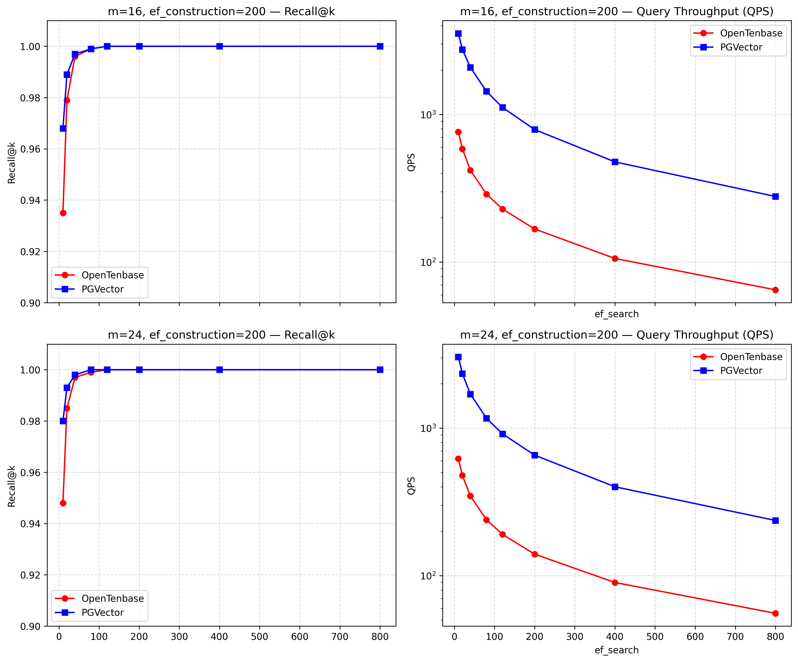

# ann benchmark测试结果

针对 OpenTenbase 和 postgres 进行了ann benchmark测试，选用的测试数据集为mnist-784-euclidean。在不同参数下的对比结果见下表：

| m  | ef_construction | ef_search | OpenTenbase (Recall) | OpenTenbase (QPS) | PGVector (Recall) | PGVector (QPS) |
|----|------------------|-----------|------------------------|-------------------|-------------------|----------------|
| 16 | 200              | 10        | 0.935                  | 760.833           | 0.968             | 3537.001       |
| 16 | 200              | 20        | 0.979                  | 584.853           | 0.989             | 2752.909       |
| 16 | 200              | 40        | 0.996                  | 419.077           | 0.997             | 2083.907       |
| 16 | 200              | 80        | 0.999                  | 288.759           | 0.999             | 1434.570       |
| 16 | 200              | 120       | 1.000                  | 228.679           | 1.000             | 1116.043       |
| 16 | 200              | 200       | 1.000                  | 167.557           | 1.000             | 789.983        |
| 16 | 200              | 400       | 1.000                  | 105.823           | 1.000             | 477.241        |
| 16 | 200              | 800       | 1.000                  | 64.858            | 1.000             | 278.101        |
| 24 | 200              | 10        | 0.948                  | 620.224           | 0.980             | 3039.511       |
| 24 | 200              | 20        | 0.985                  | 478.108           | 0.993             | 2340.378       |
| 24 | 200              | 40        | 0.997                  | 347.058           | 0.998             | 1701.742       |
| 24 | 200              | 80        | 0.999                  | 239.282           | 1.000             | 1167.392       |
| 24 | 200              | 120       | 1.000                  | 190.331           | 1.000             | 914.632        |
| 24 | 200              | 200       | 1.000                  | 139.841           | 1.000             | 655.881        |
| 24 | 200              | 400       | 1.000                  | 89.793            | 1.000             | 400.304        |
| 24 | 200              | 800       | 1.000                  | 55.531            | 1.000             | 236.527        |

对比结果图如下，横坐标为ef_search，纵坐标为QPS和Recall，下图展示了不同索引构建参数下的结果对比图。

